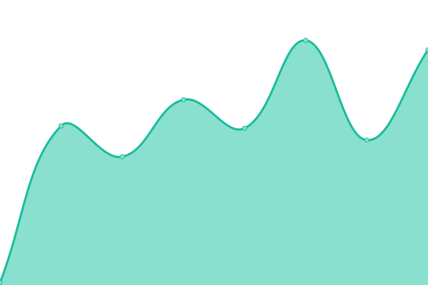
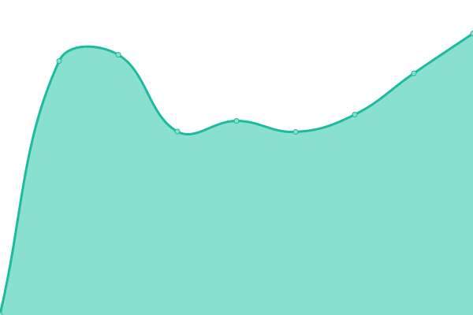

# [📈 Live Status](https://status.gogram.co): <!--live status--> **🟧 Partial outage**

This repository contains the open-source uptime monitor and status page for [Upptime](https://status.gogram.co), powered by [Upptime](https://github.com/upptime/upptime).

With [Upptime](https://status.gogram.co), you can get your own unlimited and free uptime monitor and status page, powered entirely by a GitHub repository. We use [Issues](https://github.com/upptime/upptime/issues) as incident reports, [Actions](https://github.com/enggaraziz/status/actions) as uptime monitors, and [Pages](https://status.gogram.co) for the status page.

<!--start: status pages-->
<!-- This summary is generated by Upptime (https://github.com/upptime/upptime) -->
<!-- Do not edit this manually, your changes will be overwritten -->
<!-- prettier-ignore -->
| URL | Status | History | Response Time | Uptime |
| --- | ------ | ------- | ------------- | ------ |
|  [Gogram](https://www.gogram.co) | 🟥 Down | [gogram.yml](https://github.com/enggaraziz/status/commits/HEAD/history/gogram.yml) | 

 86ms
     
 | 

<a href="https://status.gogram.co/history/gogram">0.00%</a>
    

|  [Khurus](https://www.khur.us) | 🟩 Up | [khurus.yml](https://github.com/enggaraziz/status/commits/HEAD/history/khurus.yml) | 

 1328ms
     
 | 

<a href="https://status.gogram.co/history/khurus">99.10%</a>
    

|  [Auto Follower Gratis](https://www.autofollowergratis.com) | 🟩 Up | [auto-follower-gratis.yml](https://github.com/enggaraziz/status/commits/HEAD/history/auto-follower-gratis.yml) | 

 618ms
     
 | 

<a href="https://status.gogram.co/history/auto-follower-gratis">98.08%</a>
    

<!--end: status pages-->

[**Visit our status website →**](https://status.gogram.co)

## 📄 License

- Powered by: [Upptime](https://github.com/upptime/upptime)
- Code: [MIT](./LICENSE) © [Upptime](https://status.gogram.co)
- Data in the `./history` directory: [Open Database License](https://opendatacommons.org/licenses/odbl/1-0/)
